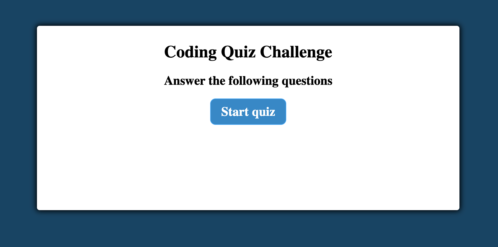
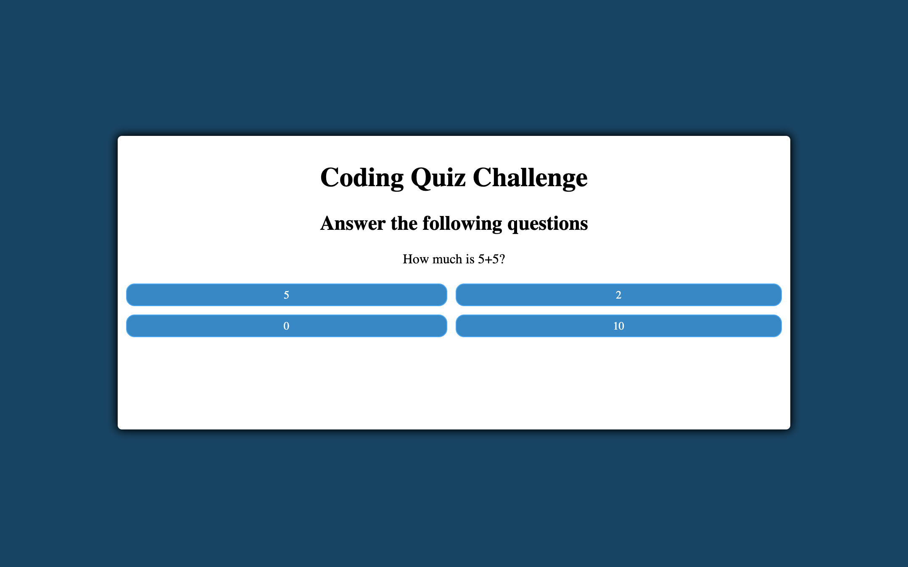
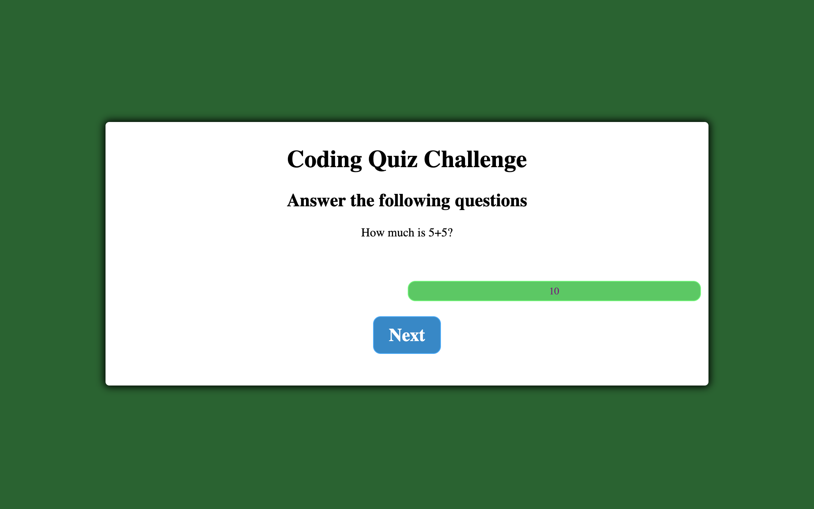
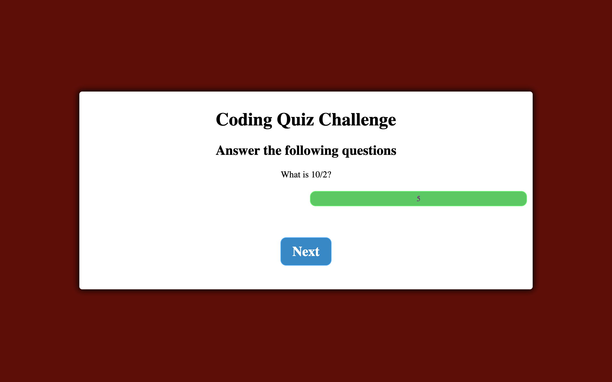
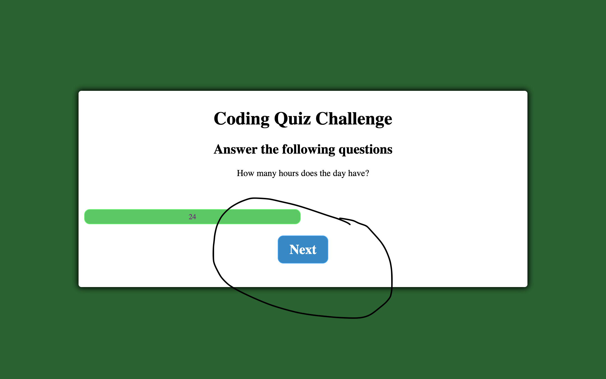
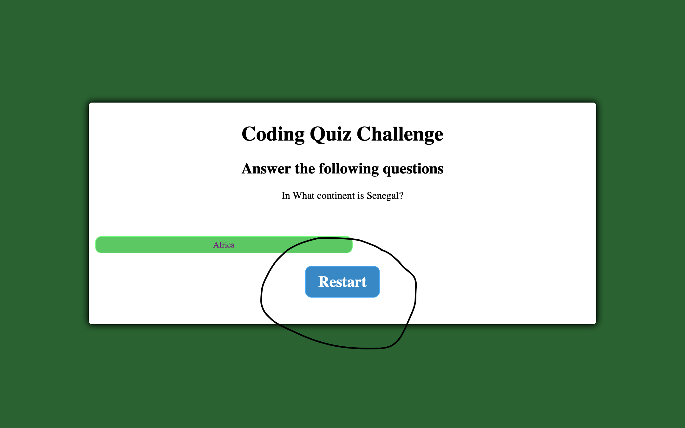

# Quiz-Multi-Choice
By Mario Viana

## Mock-up
This is the beginning of our quiz that was created with the combination of HTML, JavaScript and CSS

Then we show how it works, they will ask multiple questions where 
they will have a selection of answers for you to choose the 
correct one, this will give you some points that you will accumulate 
to give you a final score.

Every time you get a correct answer your screen will turn green
 as shown in the picture.

But if you get a wrong answer you will also get a red screen indicating 
that answer is wrong and showing you the correct answer.

Also every time you answer your questions either correctly or 
incorrectly, the next button will appear so you can advance to 
the next question.

At the end of the entire quiz the reset button will appear
so you can start the quiz again.

# Thank you for All your support!!!